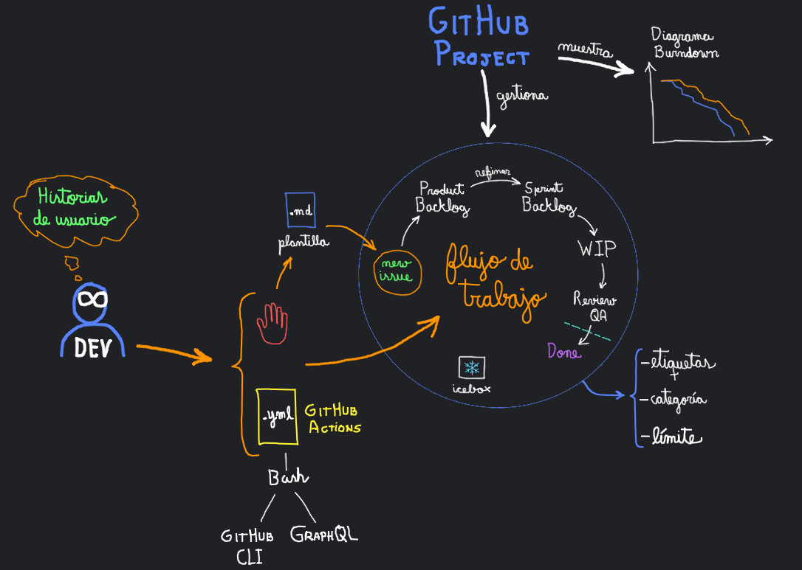
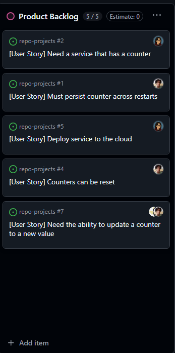
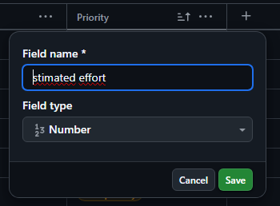
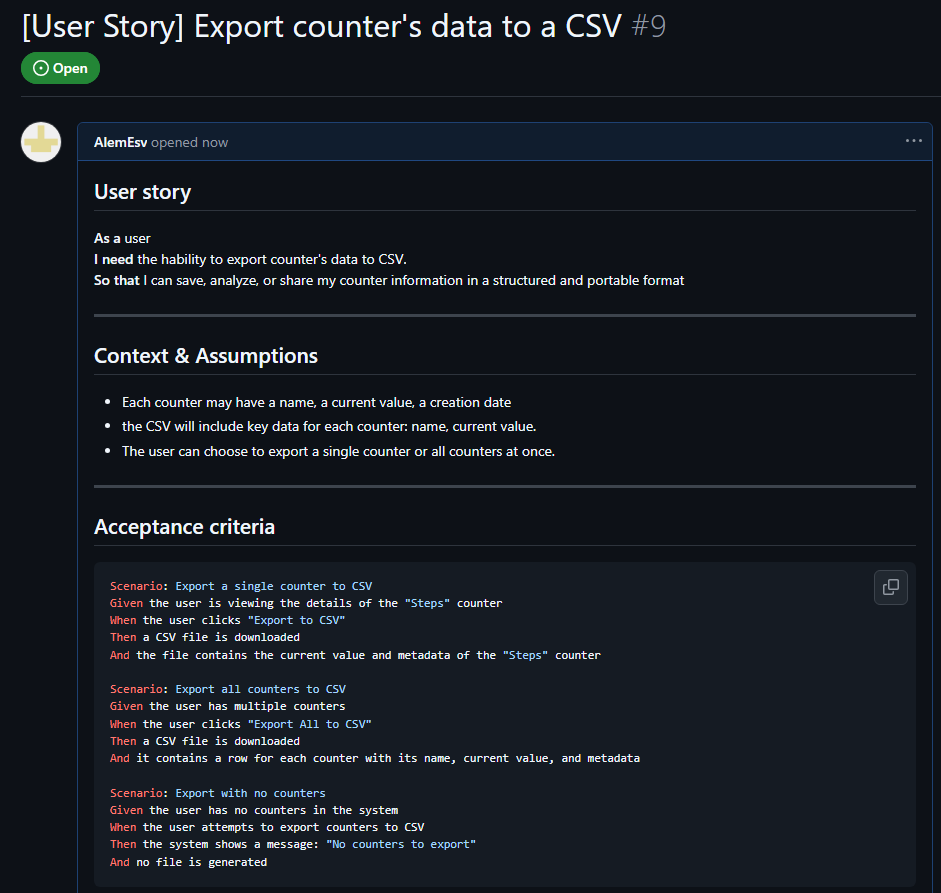
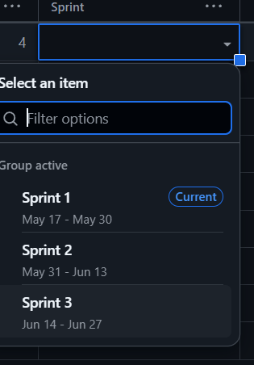
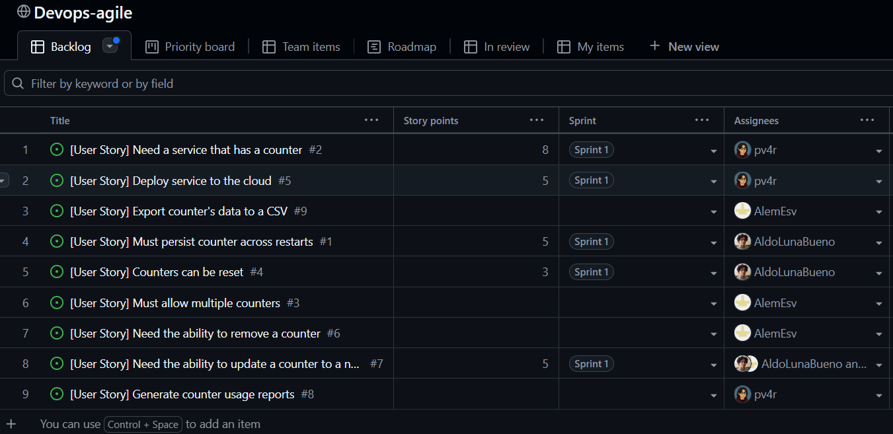

# Ejercicios



## Descripción:

Ejercicio de adaptación para mantener una gestión ágil de proyectos con GitHub Projects, configuración de Kanban Board y creación de historias de usuario.

**Objetivos:**

- Configurar y personalizar un Kanban board en GitHub Projects para gestionar el flujo de trabajo de manera eficiente.

- Crear y utilizar plantillas de issues en GitHub para estandarizar la escritura de historias de usuario.

- Organizar y priorizar el product backlog mediante la creación, edición y reordenación de historias de usuario en el Kanban board.

- Realizar el refinamiento del backlog, preparando las historias para el sprint y asegurando la correcta asignación de etiquetas y categorías.

- Utilizar GitHub Projects como una herramienta efectiva para la planificación, seguimiento y entrega de proyectos ágiles.  

### Ejercicio 1: Crear un Epic y vincular historias de usuario

1. Crea un nuevo Epic en tu Kanban board llamado "Gestión de Contadores".

	

2. Vincula las historias de usuario existentes, como "Need a service that has a counter", "Must allow multiple counters", y "Counters can be reset" a este Epic.

	`Need a service that has a counter`
	
	

	`Must allow multiple counters`
	
	

	`Counters can be reset`
	
	

	`Generate counter usage reports` (Nueva historia de usuario)

	

### Ejercicio 2: Uso avanzado de etiquetas (labels) para priorización y estado

a. **Creación de etiquetas(labels) de prioridad.**

En proyectos dentro de Github es necesario tener un control sobre qué problemas abordará el equipo en un periodo cercano de tiempo a comparación de otras actividades.

Algunas de estas marca son las siguientes:


Para este proyecto habrá 3 tipos de prioridad para abordar de manera eficiente cada reto propuesto en esta actividad.


b. **Asignación de etiquetas a historias de usuario**

Se mide la prioridad de los issues que estén en **Product Backlog** para tener una mayor concideración a la hora de abordarlos.



Luego se reagrupan, y se colocan las etiquetas para definir su prioridad en base a lo pedido en la actividad.


c. **Creación de etiquetas adicionales**

Para un mayor control se consideran etiquetas que verificarán si algún **intengrante** tiene problemas para resolver los **issues** y/o se quiera tener apuntado el avance de los **issues**.


Teniendo completado la información de los estados de cada **issue** para facilitar la gestión del flujo de trabajo.


### Ejercicio 3: Automatización de Kanban board con GitHub Actions

Para esta parte se estuvo haciendo pruebas en [un repositorio](https://github.com/AldoLunaBueno/MyRepo) y [un proyecto](https://github.com/users/AldoLunaBueno/projects/5/views/1) aparte, los cuales van a ser referenciados en todo el ejercicio.

Se codificó [un flujo de trabajo](.github/workflows/move-to-in-progress.yml) para mover automáticamente una historia de usuario a la columna "In Progress" cuando se asocia una pull request. Esto se muestra en acción en la siguiente animación gif:


> El flujo solo automatiza la acción de mover a "In Progress", no la de mover a "Done" que también se ve que sucede de forma automática en el gif. La razón es que la segunda acción es automática por defecto al cerrar una PR asociada a una historia.
> Se usó ``gh pr create`` para abrir la PR, pero se podría haber hecho manualmente desde la interfaz web de GitHub. El resultado habría sido el mismo.
> Es necesario usar "Closes #X" en el cuerpo de la PR para que el flujo detecte para qué historia se abre la PR.

La acción se desencadena cuando una PR es abierta o reabierta para su revisión:

```yml
on:
	pull_request:
        types: [opened, reopened]
```

La herramienta clave que se usó en todos los pasos de ejecución fue GitHub CLI. Esta herramienta viene integrada en el runner de GitHub Actions. 

Para usarla en el flujo es necesario autenticarse con ``gh auth login``. Una opción es usar un token personal de acceso con permisos (scopes) de repositorio, proyecto, admin y workflow. Este token se guarda como un secreto de repositorio (GH_TOKEN) en GitHub Secrets y se accede a este desde el entorno del runner con ``secrets.GH_TOKEN``. La autenticación queda así en el paso de autenticación:

```bash
echo "${{ secrets.GH_TOKEN }}" | gh auth login --with-token
```

> El problema de usar un token de acceso personal es que no hay trazabilidad de sus premisos. Una mejor opción para este ejercicio habría sido generar [un token automático](https://docs.github.com/es/actions/writing-workflows/workflow-syntax-for-github-actions#defining-access-for-the-github_token-scopes) generado desde adentro del runner de GitHub Actions. Su referencia habría sido GITHUB_TOKEN.

Pasando al paso principal, para mover una historia a la columna "In Progress" usamos este comando de GitHub CLI:

```bash
gh project item-edit --project-id "$PROJECT_ID" --id "$ITEM_ID" \
    --field-id "$FIELD_ID" --single-select-option-id "$OPTION_ID"
```

Pero este comando requiere que obtengamos previamente otros valores:

- ID del item que representa la issue que guarda la historia de usuario
- ID del proyecto
- ID del campo Status que guarda todos los estados de la tabla Kanban
- ID de la opción de selección única a la que se va a mover el item, es decir, columna "In Progress"

Y cada una de estas ID se obtiene por medio de consultas que también se hacen usando comandos de GitHub CLI usando [la sintaxis jq](https://jqlang.org/manual/). 

Por ejemplo, para obtener todos los proyectos se aplica fácilmente el comando ``gh project list`` y se obtiene una respuesta en forma de tabla:

```txt
NUMBER  TITLE                          STATE  ID                  
5       Automated Project Test         open   PVT_kwHOBtYHfM4A5HUu
3       @AldoLunaBueno's Kanban Board  open   PVT_kwHOBtYHfM4A351k
```

Si sabemos que el proyecto al cual apuntamos es el número 5, podemos copiar manualmente la ID correspondiente 'PVT_kwHOBtYHfM4A5HUu'. Pero ¿cómo se hace esto la herramienta GitHub CLI? Primero la salida debe estar en formato json, para lo cual usamos la flag ``--format``:

```bash
gh project list --format json
```

Salida:

```json
{
  "projects": [
    {
      "closed": false,
      "fields": {
        "totalCount": 10
      },
      "id": "PVT_kwHOBtYHfM4A5HUu",
      "items": {
        "totalCount": 3
      },
      "number": 5,
      "owner": {
        "login": "AldoLunaBueno",
        "type": "User"
      },
      "public": true,
      "readme": "",
      "shortDescription": "",
      "title": "Automated Project Test",
      "url": "https://github.com/users/AldoLunaBueno/projects/5"
    },
	...
```

Y esta salida en formato json se filtra con una consulta jq incorporada en GitHub CLI con la flag --jq o solo -q:

```bash
PROJECT_ID=$(gh project list --format json \
    -q ".projects[]|select(.number == 5).id")
```

Lo que hace este filtro es seleccionar de entre todos los proyectos solo el que tenga una clave "number" con el valor 5, que es el número del proyecto al que apuntamos, y de toda la información del proyecto solo se toma su ID.

Algunos valores se guardaron en la parte `env` del paso principal en claves (en mayúsculas):

```yml
env:
	PR_NUMBER: ${{ github.event.pull_request.number }}
	PROJECT_NUMBER: 5 # project number asociated with repo
	ORG: "@me" # owner of the personal authentication token (for project, not PR)
	STATUS_NAME: "In Progress"
```

Se accede a estas claves lo largo de la ejecución del paso principal usando el símbolo de dolar ($) como cualquier variable de Bash.

### Ejercicio 4: Seguimiento de tiempo y esfuerzo

Creación de un nuevo campo para concretar entre todo el equipo las horas necesarias que tomarán cada uno de los issues en el sprint.



Se coloca estimaciones para cada uno de los **issues abiertos** que existen en el momento, así saber qué funcionalidades costarán menos esfuerzo de realizar.


Esto nos ayuda como equipo a tener un seguimiento más preciso del esfuerzo que realmente estamos dedicando, a identificar posibles desviaciones respecto a lo estimado y a tomar decisiones más informadas en las retrospectivas.

### Ejercicio 5: Refinamiento de backlog basado en comentarios de los stakeholders

Se ha visto comentarios de stakeholders que piden necesitan una funcionalidad para poder exportar los datos del contador a CSV, por lo que se creará un nuevo **issue** que aborde dicha funcionalidad.



Para mayor detalle en la visualización de los criterios de aceptación:

```gherkin
Scenario: Export a single counter to CSV
Given the user is viewing the details of the counter
When the user clicks "Export to CSV"
Then a CSV file is downloaded

Scenario: Export all counters to CSV
Given the user has multiple counters
When the user clicks "Export All to CSV"
Then a CSV file is downloaded

Scenario: Export with no counters
Given the user has no counters in the system
When the user attempts to export counters to CSV
Then the system shows a message: "No counters to export"
```

Luego se le colocan los labels de alta prioridad y se denota que estará listo para entrár al siguiente sprint.


### Ejercicio 6: Análisis del flujo de trabajo usando el Kanban board
(In progress...)

## Actividad: Gestión ágil de sprints con GitHub, planificación, ejecución y cierre de Sprints

### Configuración de Sprints

GitHub configurará tres sprints de forma predeterminada para empezar. Luego, creará nuevos sprints automáticamente según sea necesario.




Sprint plan:

Asignaremos puntos de historia estimados y un sprint


y moveremos las historias del Product Backlog al Sprint Backlog para construir nuestro plan.


Simulación de flujo de trabajo diario:

Se moverán historias desde la parte superior del Sprint Backlog a la columna In Progress, como se muestra a continuación.


Al finalizar las revisiones en Q/A, veremos como el backlog Kanba habrá cambiado.


### Configuración del Burndown Chart

- Hacer click en el menú desplegable junto a `Backlog` y seleccionar `Generate Chart`

	

- Nos redirige a `Insights` donde vemos un gráfico predeterminado para el proyecto

	

- Para mostrar el estado de las historias en la columna `Done` en lugar del gráfico predeterminado, se aplica un filtro.

	

- Configuramos el gráfico

	

- Para centrar el gráfico en un sprint específico, usamos la opción de filtro. Escribimos **sprint:** en el cuadro de filtro y seleccionamos el sprint como **Sprint 1**

	
