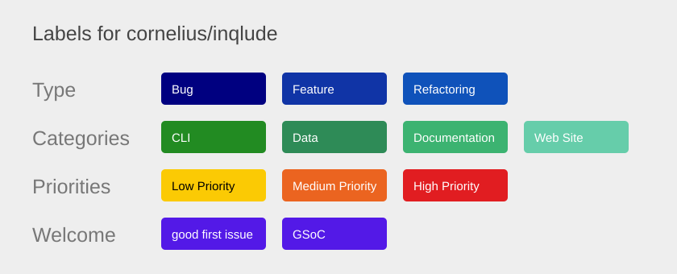
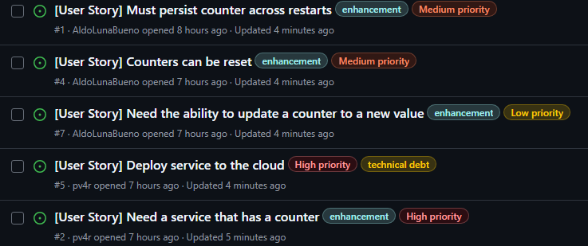

# Ejercicios (WIP)

### Ejercicio 1: Crear un Epic y vincular historias de usuario

### Ejercicio 2: Uso avanzado de etiquetas (labels) para priorización y estado

a. **Creación de etiquetas(labels) de prioridad.**

En proyectos dentro de Github es necesario tener un control sobre qué problemas abordará el equipo en un periodo cercano de tiempo a comparación de otras actividades.

Algunas de estas marca son las siguientes:

Para este proyecto habrá 3 tipos de prioridad para abordar de manera eficiente cada reto propuesto en esta actividad.

b. **Asignación de etiquetas a historias de usuario**

Se mide la prioridad de los issues que estén en **Product Backlog** para tener una mayor concideración a la hora de abordarlos.

Luego se reagrupan, y se colocan las etiquetas para definir su prioridad en base a lo pedido en la actividad.

c. **Creación de etiquetas adicionales**

Para un mayor control se consideran etiquetas que verificarán si algún **intengrante** tiene problemas para resolver los **issues** y/o se quiera tener apuntado el avance de los **issues**.

Teniendo completado la información de los estados de cada **issue** para facilitar la gestión del flujo de trabajo.

### Ejercicio 3: Automatización de Kanban board con GitHub Actions

### Ejercicio 4: Seguimiento de tiempo y esfuerzo usando GitHub Projects

### Ejercicio 5: Refinamiento de backlog basado en comentarios de los stakeholders

### Ejercicio 6: Análisis del flujo de trabajo usando el Kanban board
