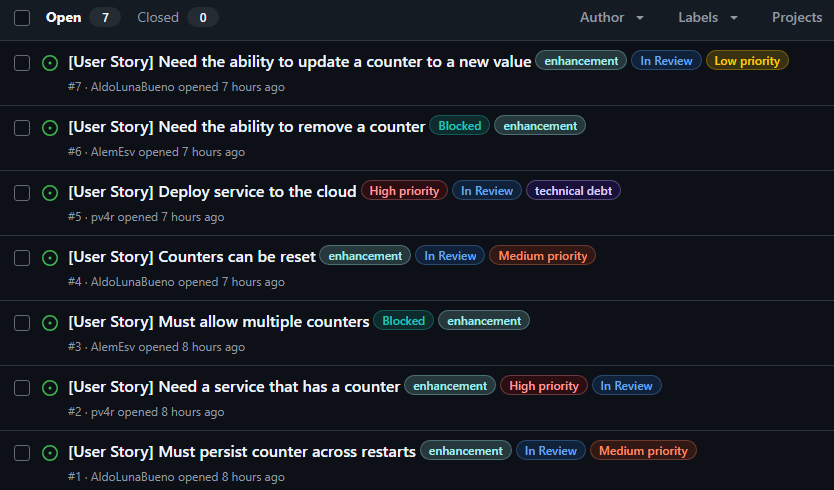
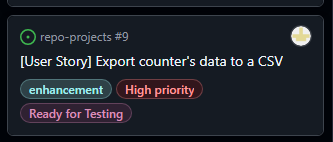

# Ejercicios (WIP)

## Descripción:

Ejercicio de adaptación para mantener una gestión ágil de proyectos con GitHub Projects, configuración de Kanban Board y creación de historias de usuario.

**Objetivos:**

- Configurar y personalizar un Kanban board en GitHub Projects para gestionar el flujo de trabajo de manera eficiente.

- Crear y utilizar plantillas de issues en GitHub para estandarizar la escritura de historias de usuario.

- Organizar y priorizar el product backlog mediante la creación, edición y reordenación de historias de usuario en el Kanban board.

- Realizar el refinamiento del backlog, preparando las historias para el sprint y asegurando la correcta asignación de etiquetas y categorías.

- Utilizar GitHub Projects como una herramienta efectiva para la planificación, seguimiento y entrega de proyectos ágiles.  

### Ejercicio 1: Crear un Epic y vincular historias de usuario

1. Crea un nuevo Epic en tu Kanban board llamado "Gestión de Contadores".

	

2. Vincula las historias de usuario existentes, como "Need a service that has a counter", "Must allow multiple counters", y "Counters can be reset" a este Epic.

	`Need a service that has a counter`
	
	

	`Must allow multiple counters`
	
	

	`Counters can be reset`
	
	

	`Generate counter usage reports` (Nueva historia de usuario)

	

### Ejercicio 2: Uso avanzado de etiquetas (labels) para priorización y estado

a. **Creación de etiquetas(labels) de prioridad.**

En proyectos dentro de Github es necesario tener un control sobre qué problemas abordará el equipo en un periodo cercano de tiempo a comparación de otras actividades.

Algunas de estas marca son las siguientes:


Para este proyecto habrá 3 tipos de prioridad para abordar de manera eficiente cada reto propuesto en esta actividad.


b. **Asignación de etiquetas a historias de usuario**

Se mide la prioridad de los issues que estén en **Product Backlog** para tener una mayor concideración a la hora de abordarlos.


Luego se reagrupan, y se colocan las etiquetas para definir su prioridad en base a lo pedido en la actividad.


c. **Creación de etiquetas adicionales**

Para un mayor control se consideran etiquetas que verificarán si algún **intengrante** tiene problemas para resolver los **issues** y/o se quiera tener apuntado el avance de los **issues**.


Teniendo completado la información de los estados de cada **issue** para facilitar la gestión del flujo de trabajo.



### Ejercicio 3: Automatización de Kanban board con GitHub Actions

### Ejercicio 4: Seguimiento de tiempo y esfuerzo

Creación de un nuevo campo para concretar entre todo el equipo las horas necesarias que tomarán cada uno de los issues en el sprint.


Se coloca estimaciones para cada uno de los **issues abiertos** que existen en el momento, así saber qué funcionalidades costarán menos esfuerzo de realizar.


Esto nos ayuda como equipo a tener un seguimiento más preciso del esfuerzo que realmente estamos dedicando, a identificar posibles desviaciones respecto a lo estimado y a tomar decisiones más informadas en las retrospectivas.

### Ejercicio 5: Refinamiento de backlog basado en comentarios de los stakeholders

Se ha visto comentarios de stakeholders que piden necesitan una funcionalidad para poder exportar los datos del contador a CSV, por lo que se creará un nuevo **issue** que aborde dicha funcionalidad.


Para mayor detalle en la visualización de los criterios de aceptación:

```gherkin
Scenario: Export a single counter to CSV
Given the user is viewing the details of the counter
When the user clicks "Export to CSV"
Then a CSV file is downloaded

Scenario: Export all counters to CSV
Given the user has multiple counters
When the user clicks "Export All to CSV"
Then a CSV file is downloaded

Scenario: Export with no counters
Given the user has no counters in the system
When the user attempts to export counters to CSV
Then the system shows a message: "No counters to export"
```

Luego se le colocan los labels de alta prioridad y se denota que estará listo para entrár al siguiente sprint.



### Ejercicio 6: Análisis del flujo de trabajo usando el Kanban board
